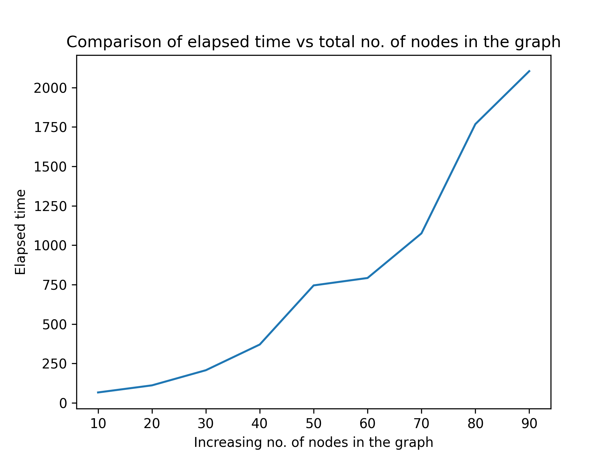

# Kruskal’s Minimum Spanning Tree Algorithm( Detection of cycles using node, subtree, element count logic)

## Introduction
Read on [Medium](https://akcgjc007.medium.com/kruskals-minimum-spanning-tree-algorithm-detection-of-cycles-using-node-subtree-element-count-d995cf8f8bc3)

## Directory structure
```
.
├── main.cpp: the main file for executing
├── main.h: the header file including structs and classes
├── p107_network.txt: input file from Project Euler
├── Makefile
└── README.md
```

## How to run?
 - `make`: Run the algorithm
 - `make clean`: cleaning

## Dry run on random data
```
g++ main.cpp
./a.out
Elapsed time for running the kruskal algorithm.
~time->  17.000000 ms.
Vertex 0 -> 1 
Vertex 1 -> 0 2 3 7 
Vertex 2 -> 1 8 
Vertex 3 -> 1 9 
Vertex 4 -> 6 
Vertex 5 -> 9 
Vertex 6 -> 4 8 
Vertex 7 -> 1 
Vertex 8 -> 2 6 
Vertex 9 -> 3 5 

Total cost of the network 193
The cost of the MST is 7
Total savings are 186
Yes it is a TREE.
Elapsed time for the whole process.
~time->  119.000000 ms.
```
## Graph between time vs. n

